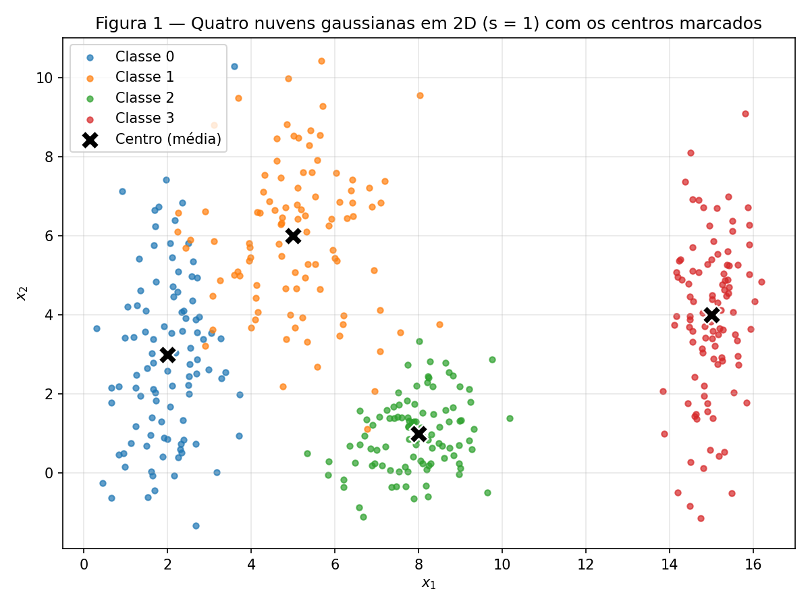
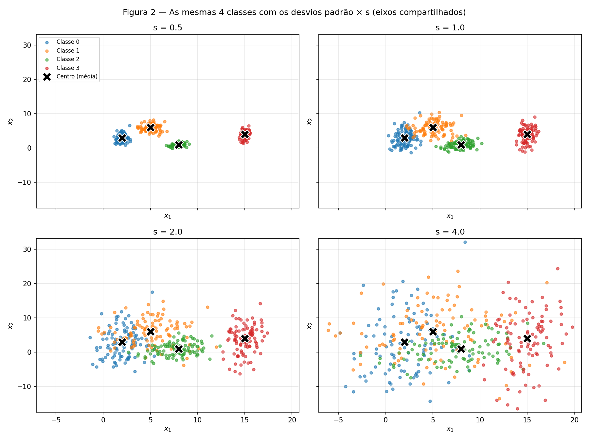
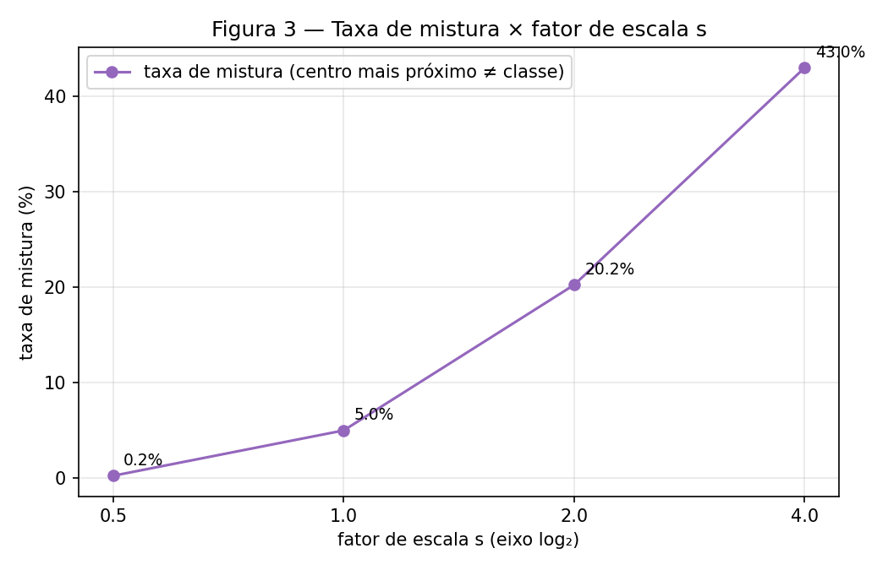
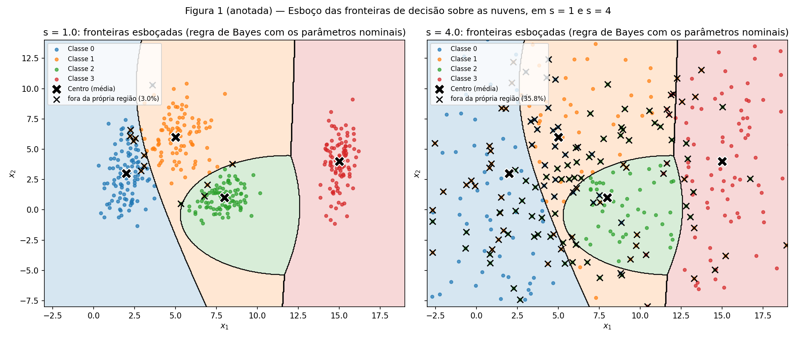
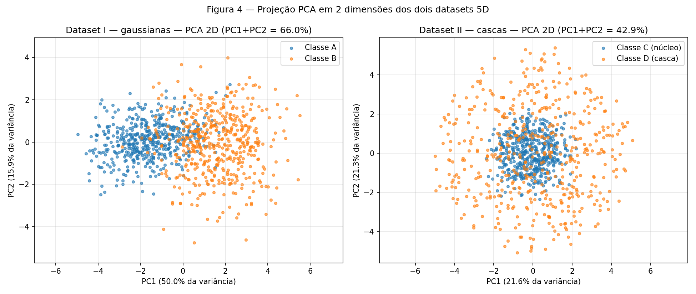
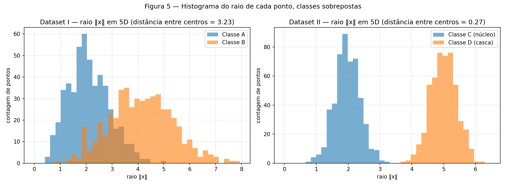
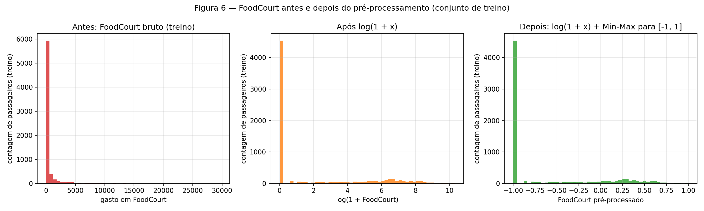

# Data

!!! info inline end "Exercício"

    Data — geometria, espalhamento e pré-processamento

    Fontes: [`code/`](https://github.com/carloshernanic/ann-dl/tree/main/docs/exercises/data/code) ·
    Figuras: [`figures/`](https://github.com/carloshernanic/ann-dl/tree/main/docs/exercises/data/figures)

O fio condutor desta atividade é o **espalhamento** dos dados: quanto uma nuvem
de pontos se espalha, em que direção, e como isso muda a dificuldade de
classificação. São três exercícios: nuvens gaussianas em 2D, dois datasets em 5D
(um linearmente separável, outro não) e o pré-processamento do dataset real
*Spaceship Titanic* para uma rede com ativação `tanh`.

Regras seguidas em todo o relatório: semente fixa com `rng = np.random.default_rng(42)`,
apenas `numpy`, `pandas`, `matplotlib` e `scikit-learn` (este último só para
PCA e pré-processamento), nenhum modelo treinado. Cada exercício tem um script em
`code/` que gera as figuras de `figures/` e imprime todos os números citados no
texto:

| Script | O que produz |
|---|---|
| [`code/ex1_clouds.py`](https://github.com/carloshernanic/ann-dl/blob/main/docs/exercises/data/code/ex1_clouds.py) | Figuras 1, 2, 3 e o esboço das fronteiras; tabela de $r_{ij}$ e taxas de mistura |
| [`code/ex2_nonlinearity.py`](https://github.com/carloshernanic/ann-dl/blob/main/docs/exercises/data/code/ex2_nonlinearity.py) | Figuras 4 e 5; variância explicada, distância entre centros, separador não linear |
| [`code/ex3_spaceship.py`](https://github.com/carloshernanic/ann-dl/blob/main/docs/exercises/data/code/ex3_spaceship.py) | Figura 6; descrição do dataset, split, pré-processamento e checagens |

Para rodar: baixe o `train.csv` do
[Spaceship Titanic](https://www.kaggle.com/competitions/spaceship-titanic) para
`data/spaceship-titanic/train.csv` na raiz do repositório (a pasta é ignorada
pelo git) e execute `python docs/exercises/data/code/<script>.py` de qualquer
diretório.

---

## Exercício 1

**Nuvens de Pontos: Geometria e Espalhamento em 2D**

### A — Gere as nuvens

Foram geradas 400 amostras, 100 por classe, com distribuição gaussiana de eixos
independentes e os parâmetros do enunciado:

| Classe | Média $\mu$ | Desvio padrão $\sigma$ | $\bar\sigma = (\sigma_x + \sigma_y)/2$ |
|---|---|---|---|
| 0 | [2, 3] | [0.8, 2.5] | 1.65 |
| 1 | [5, 6] | [1.2, 1.9] | 1.55 |
| 2 | [8, 1] | [0.9, 0.9] | 0.90 |
| 3 | [15, 4] | [0.5, 2.0] | 1.25 |

Um detalhe de implementação que importa para o item B: o ruído padrão
$z \sim \mathcal{N}(0, 1)$ de cada ponto é sorteado **uma única vez**, e cada
dataset é construído como $x = \mu + (s\,\sigma)\,z$. Assim o dataset da
Figura 1 é exatamente o dataset de $s = 1$ do item B, e os quatro datasets de B
diferem *somente* pelo espalhamento.

``` python
--8<-- "docs/exercises/data/code/ex1_clouds.py"
```


/// caption
**Figura 1** — As quatro nuvens gaussianas ($s = 1$), uma cor por classe, com o
centro (média nominal) de cada nuvem marcado com um X preto.
///

As classes 0 e 1 já se tocam em $s = 1$: a classe 0 é muito alongada no eixo
vertical ($\sigma_y = 2.5$) e "sobe" até a região da classe 1. A classe 2 é a
mais compacta e a classe 3, muito distante em $x_1$, está isolada.

### B — Mais ou menos espalhado

Os quatro datasets ($s \in \{0.5, 1.0, 2.0, 4.0\}$) têm as mesmas 4 classes e
as mesmas médias; apenas os desvios padrão são multiplicados por $s$.


/// caption
**Figura 2** — As mesmas 4 classes com os desvios padrão multiplicados por $s$.
Os quatro painéis compartilham os mesmos limites de eixo (definidos pelo caso
$s = 4$), para que a comparação seja honesta.
///

**Razão de separação em $s = 1$.** Com
$r_{ij} = \lVert\mu_i - \mu_j\rVert / (\bar\sigma_i + \bar\sigma_j)$ e os
parâmetros nominais da tabela do item A:

| Par $(i, j)$ | $\lVert\mu_i - \mu_j\rVert$ | $\bar\sigma_i + \bar\sigma_j$ | $r_{ij}$ |
|---|---|---|---|
| (0, 1) | 4.243 | 3.200 | **1.326** |
| (0, 2) | 6.325 | 2.550 | 2.480 |
| (0, 3) | 13.038 | 2.900 | 4.496 |
| (1, 2) | 5.831 | 2.450 | 2.380 |
| (1, 3) | 10.198 | 2.800 | 3.642 |
| (2, 3) | 7.616 | 2.150 | 3.542 |

O **menor** $r_{ij}$ é o do par **(0, 1)**, com $r_{01} = 1.326$: a distância
entre os centros é só 1.3 vezes a soma dos espalhamentos médios. Como as médias
nunca mudam e todos os $\sigma$ são multiplicados por $s$, $r_{ij}$ escala com
$1/s$; logo, em $s = 2$ o menor $r_{ij}$ vale $1.326 / 2 = 0.663$, sem precisar
gerar nada de novo (e em $s = 4$, $0.331$; em $s = 0.5$, $2.652$).

**Taxa de mistura.** Para cada $s$, a fração de pontos cujo centro de classe
mais próximo (entre as 4 médias nominais, distância euclidiana) *não* é o da
própria classe — uma medida puramente geométrica, sem treinar nada:

| $s$ | Taxa de mistura | Menor $r_{ij}$ ($= 1.326/s$) |
|---|---|---|
| 0.5 | 0.25 % (1 de 400) | 2.652 |
| 1.0 | 5.00 % (20 de 400) | 1.326 |
| 2.0 | 20.25 % (81 de 400) | 0.663 |
| 4.0 | 43.00 % (172 de 400) | 0.331 |


/// caption
**Figura 3** — Taxa de mistura em função do fator de escala $s$ (eixo horizontal
em escala log$_2$).
///

**A partir de qual $s$ as nuvens deixam de poder ser separadas por retas?** Entre
$s = 1$ e $s = 2$. Em $s = 1$ a taxa de mistura é de 5 %, concentrada na
fronteira 0–1, e o menor $r_{ij}$ ainda é maior que 1: os centros estão mais
distantes do que a soma dos espalhamentos, então retas erram só nas caudas. Em
$s = 2$ o menor $r_{ij}$ cai para $0.663 < 1$: as regiões de 1$\sigma$ das
classes 0 e 1 se interpenetram, a classe 2 passa a se misturar com as duas, e a
taxa de mistura salta para 20 %. A partir daí nenhum conjunto de retas separa
as classes — um quinto dos pontos está literalmente mais perto do centro de
outra classe. O limiar $r_{ij} \approx 1$ é o ponto em que a separabilidade
linear se perde; em $s = 4$ ($r_{01} = 0.33$) só a classe 3 ainda é
reconhecível.

### C — Análise

**1. Sobreposição em $s = 1$.** As classes 0 e 1 se sobrepõem na diagonal entre
seus centros (a classe 0 se estende verticalmente até $x_2 \approx 8$ e a classe
1 desce até $x_2 \approx 2$); a classe 2 encosta na cauda inferior da classe 1;
a classe 3 está isolada. Uma **única** fronteira linear não separa as quatro
classes: uma reta divide o plano em apenas duas regiões, e aqui há quatro
classes dispostas ao longo de $x_1$ com a classe 1 deslocada para cima. Já um
**conjunto** de fronteiras lineares (três cortes: um vertical em
$x_1 \approx 12$ isolando a classe 3, um diagonal entre 0 e 1 e um separando a
classe 2 das demais) classifica corretamente cerca de 95 % dos pontos — é
exatamente o que a regra do centro mais próximo faz, com 5 % de mistura.

**2. Esboço das fronteiras.** O painel esquerdo da figura abaixo desenha sobre
a Figura 1 as fronteiras que uma rede treinada tenderia a aproximar. Como
esboço usei a regra de decisão bayesiana com os parâmetros nominais das
gaussianas (nada foi treinado — apenas se comparou a densidade de cada classe em
uma grade). As fronteiras são quase retas entre as classes 0, 1 e 3, e uma
curva fechada em torno da classe 2, que é compacta e "recorta" uma ilha dentro
da região da classe 1. Os X pretos marcam os pontos que caem fora da região da
própria classe.


/// caption
**Figura 1 (anotada)** — Esboço das fronteiras de decisão sobre as nuvens, em
$s = 1$ (esquerda) e $s = 4$ (direita). Regiões coloridas: classe atribuída pela
regra de Bayes com os parâmetros nominais; X pretos: pontos fora da região da
própria classe.
///

**3. Relação com o item B.** A rede *necessariamente* erra na região onde as
densidades das classes se sobrepõem, porque ali pontos de classes diferentes
são indistinguíveis por posição. Em $s = 1$ essa região é a faixa estreita
entre as classes 0 e 1 (3.0 % dos pontos ficam fora da própria região mesmo
com a fronteira ótima). Quando o espalhamento cresce, as fronteiras em si mal
mudam de lugar — dependem das médias, que são fixas — mas a região de
sobreposição engorda até engolir as nuvens: em $s = 4$, 35.8 % dos pontos caem
na região de outra classe. Ou seja, quanto mais espalhadas as nuvens, maior a
região onde a rede erra de forma irredutível, e nenhuma arquitetura resolve
isso: é limitação dos dados, não do modelo.

---

## Exercício 2

**Não-Linearidade em Dimensões Superiores**

### A — Dataset I: gaussianas multivariadas

500 amostras por classe em $\mathbb{R}^5$, com
$\mu_A = [0, 0, 0, 0, 0]$, $\mu_B = [1.5, 1.5, 1.5, 1.5, 1.5]$ e as matrizes
de covariância $\Sigma_A$ e $\Sigma_B$ do enunciado, geradas com
`rng.multivariate_normal`. Os espalhamentos são diferentes: $\Sigma_B$ tem
variâncias maiores (1.5 contra 1.0) e correlação negativa entre as duas
primeiras features, enquanto $\Sigma_A$ tem correlação positiva (0.8).

``` python
--8<-- "docs/exercises/data/code/ex2_nonlinearity.py"
```

### B — Dataset II: cascas concêntricas

500 amostras por classe em $\mathbb{R}^5$, com estrutura radial: direção
$u = v / \lVert v\rVert$ com $v \sim \mathcal{N}(0, I_5)$ (uniforme na esfera
unitária), raio $\rho \sim \mathcal{N}(2.0, 0.4)$ para a classe C (núcleo) e
$\rho \sim \mathcal{N}(5.0, 0.4)$ para a classe D (casca), e $x = \rho \cdot u$.
Interpretei o segundo parâmetro de $\mathcal{N}(\cdot, 0.4)$ como desvio padrão.

### C — Visualize e compare


/// caption
**Figura 4** — Projeção PCA em 2D dos dois datasets, colorida por classe. PCA
ajustada em cada dataset completo (não supervisionada).
///

**Variância explicada pelos dois primeiros componentes:**

| Dataset | PC1 | PC2 | PC1 + PC2 |
|---|---|---|---|
| I (gaussianas) | 50.0 % | 15.9 % | **66.0 %** |
| II (cascas) | 21.6 % | 21.3 % | **42.9 %** |

A projeção 2D preserva melhor a informação relevante para a classificação no
**Dataset I**. Ali a direção de maior variância coincide com a direção que
separa as classes (a diferença de médias, $[1.5, \dots, 1.5]$, mais a
correlação forte entre $x_1$ e $x_2$), e na Figura 4 as classes A e B aparecem
como duas nuvens deslocadas ao longo de PC1. No Dataset II a distribuição é
isotrópica — cada componente explica cerca de 1/5 da variância (21.6 %, 21.3 %,
…) — e a PCA não tem direção preferencial: a projeção mostra o núcleo dentro da
casca, e a informação de classe (o raio) fica repartida igualmente pelas 5
dimensões.

**Medidas geométricas em 5D** (sem reduzir dimensionalidade):

| Dataset | Distância entre os centros $\lVert\mu_1 - \mu_2\rVert$ | Raio médio classe 1 | Raio médio classe 2 |
|---|---|---|---|
| I | **3.228** (nominal: $1.5\sqrt{5} = 3.354$) | A: 2.11 (0.51 a 4.98) | B: 4.13 (0.95 a 7.93) |
| II | **0.266** | C: 1.97 (0.80 a 3.25) | D: 5.01 (3.75 a 6.25) |


/// caption
**Figura 5** — Histograma do raio $\lVert x\rVert$ de cada ponto em 5D, com as
duas classes sobrepostas no mesmo eixo, para cada dataset.
///

No Dataset I os centros estão a 3.23 de distância e os histogramas de raio se
sobrepõem (a classe B tem raio maior só porque está deslocada da origem). No
Dataset II os centros praticamente coincidem (0.27, que é só ruído amostral em
torno de zero), mas os raios não se tocam: o maior raio da classe C é 3.25 e o
menor da classe D é 3.75.

### D — Análise

**1. Centros coincidentes, raios separados.** Um hiperplano $w^\top x + b = 0$
só usa uma combinação linear das entradas; para separar duas classes, ele
precisa que as projeções $w^\top x$ tenham distribuições deslocadas. No Dataset
II as duas classes têm o mesmo centro e são esfericamente simétricas, então para
*qualquer* $w$ a projeção de cada classe é simétrica em torno do mesmo valor:
todo hiperplano que passe pelo centro deixa metade de cada classe de cada lado,
e um hiperplano afastado do centro deixa quase tudo do mesmo lado. Verifiquei
isso numericamente: o melhor corte ao longo de PC1 acerta apenas 63.8 % no
Dataset II, contra 87.7 % no Dataset I. Os histogramas de raio, por outro lado,
mostram que as classes são perfeitamente separáveis — só que por uma
superfície esférica, não por um hiperplano.

**2. Por que mais dados não resolvem.** A inseparabilidade linear do Dataset II
é uma propriedade da geometria, não da amostra. As classes diferem apenas em
$\lVert x\rVert$, uma função *quadrática* das entradas; coletar mais pontos só
preenche melhor as mesmas duas cascas. Como a casca D envolve o núcleo C em
todas as direções, qualquer região "de um lado de um hiperplano" que contenha a
maior parte de D também contém C inteiro. Um Perceptron ficaria eternamente em
torno de 50–65 % de acerto; é preciso uma transformação não linear das entradas
(uma camada oculta, ou uma feature construída à mão).

**3. PCA é linear.** Não: uma projeção 2D em que as classes parecem misturadas
**não** prova que elas são inseparáveis no espaço original. A PCA escolhe as
direções de maior variância, que não têm nenhuma obrigação de ser as direções
que separam as classes, e ela é linear — descarta exatamente o tipo de estrutura
(quadrática, radial) que define o Dataset II. Meus resultados mostram isso: na
Figura 4 o Dataset II parece um borrão com o núcleo dentro da casca, e mesmo
assim a função simples

$$
f(x) = \lVert x\rVert^2 = \sum_{i=1}^{5} x_i^2, \qquad \text{classe D} \iff f(x) > 3.5^2 = 12.25
$$

classifica corretamente **100 %** dos 1000 pontos (o maior $f$ da classe C é
10.54 e o menor da classe D é 14.08). Basta uma camada que calcule $x_i^2$ — ou
uma rede com ativações não lineares, que aprende essa feature sozinha — para o
problema virar linearmente separável.

---

## Exercício 3

**Preparando Dados do Mundo Real para uma Rede Neural**

### A — Conheça os dados

O `train.csv` do Spaceship Titanic tem **8693 passageiros e 14 colunas**. O
objetivo é prever `Transported`: se o passageiro foi transportado para outra
dimensão durante a anomalia espaço-temporal (`True`) ou não (`False`). O alvo é
praticamente **balanceado**: 4378 `True` (**50.36 %**) contra 4315 `False`
(49.64 %).

``` python
--8<-- "docs/exercises/data/code/ex3_spaceship.py"
```

**Tipos de feature:**

| Tipo | Colunas |
|---|---|
| Numéricas | `Age`, `RoomService`, `FoodCourt`, `ShoppingMall`, `Spa`, `VRDeck` |
| Categóricas | `HomePlanet` (3 valores), `CryoSleep` (bool), `Destination` (3 valores), `VIP` (bool) |
| Descartadas | `PassengerId` (identificador), `Cabin` (código deck/num/side), `Name` (texto livre) |

**Valores faltantes por coluna** (2324 células faltantes; 2087 linhas, 24 % do
total, têm pelo menos um `NaN`; só `PassengerId` e `Transported` estão
completas):

| Coluna | Faltantes | % |
|---|---|---|
| HomePlanet | 201 | 2.31 |
| CryoSleep | 217 | 2.50 |
| Cabin | 199 | 2.29 |
| Destination | 182 | 2.09 |
| Age | 179 | 2.06 |
| VIP | 203 | 2.34 |
| RoomService | 181 | 2.08 |
| FoodCourt | 183 | 2.11 |
| ShoppingMall | 208 | 2.39 |
| Spa | 183 | 2.11 |
| VRDeck | 188 | 2.16 |
| Name | 200 | 2.30 |

**Colunas de gasto** (dataset completo, sem imputação):

| Coluna | Média | Mediana | Máximo | Fração de zeros |
|---|---|---|---|---|
| RoomService | 224.69 | 0 | 14 327 | 64.2 % |
| FoodCourt | 458.08 | 0 | 29 813 | 62.8 % |
| ShoppingMall | 173.73 | 0 | 23 492 | 64.3 % |
| Spa | 311.14 | 0 | 22 408 | 61.2 % |
| VRDeck | 304.85 | 0 | 24 133 | 63.2 % |

Em todas as cinco a **mediana é 0** enquanto a média fica entre 170 e 460 e o
máximo passa de 14 000: mais de 60 % dos passageiros não gastaram nada, e a
média é puxada por uma minoria que gasta milhares. Isso indica distribuições
extremamente **assimétricas à direita, de cauda pesada**, com um pico em zero:
o espalhamento não é "em torno de um valor típico" (o desvio padrão é maior que
a média) mas dominado por poucos valores extremos. Para uma rede, isso significa
que sem transformação a escala dessas colunas seria ditada pelos outliers.

### B — Separe antes de transformar

O split é **80/20, estratificado por `Transported`, com `random_state = 42`**:
treino com 6954 linhas (50.36 % positivos) e teste com 1739 linhas (50.37 %
positivos). Antes de qualquer imputação ou escalonamento, no **treino**,
`FoodCourt` tem média **452.61**, mediana **0** e máximo **29 813**.

Por que separar *antes*: toda estatística usada nas transformações — a mediana
que preenche os faltantes, o mínimo e o máximo do escalonamento, as categorias
conhecidas pelo one-hot — é aprendida a partir dos dados. Se ela for calculada
no dataset inteiro, informação do conjunto de teste entra no pré-processamento
e o teste deixa de ser um conjunto "nunca visto"; o desempenho medido fica
otimista e não reproduz o que acontece em produção, onde os dados novos chegam
depois de tudo estar ajustado. Por isso cada transformador é ajustado (`fit`)
no treino e apenas aplicado (`transform`) no teste.

### C — Pré-processe

**1. Dados faltantes.** Colunas numéricas: imputação pela **mediana** do
treino — robusta à cauda pesada dos gastos (a média seria puxada para centenas
de unidades por poucos passageiros) e, para os gastos, a mediana é 0, o valor
mais plausível para quem não consumiu. Os valores aprendidos foram `Age = 27`
e `0` para as cinco colunas de gasto. Colunas categóricas: imputação pela
**categoria mais frequente** do treino — `HomePlanet = Earth`,
`CryoSleep = False`, `Destination = TRAPPIST-1e`, `VIP = False` — que preserva a
distribuição marginal e não inventa uma categoria artificial para 2 % das
linhas. Os dois imputadores são ajustados no treino e aplicados ao teste.

**2. Features categóricas.** `HomePlanet`, `CryoSleep`, `Destination` e `VIP`
viram **one-hot** com `OneHotEncoder(handle_unknown="ignore", drop="if_binary")`
ajustado no treino, produzindo 8 colunas: `HomePlanet_{Earth, Europa, Mars}`,
`CryoSleep_True`, `Destination_{55 Cancri e, PSO J318.5-22, TRAPPIST-1e}` e
`VIP_True` (as binárias ficam com uma coluna só). Uma categoria que aparece no
teste mas não no treino é tratada por `handle_unknown="ignore"`: ela vira um
vetor **todo zero** nas colunas daquela variável — nenhuma coluna nova é criada,
o conjunto de colunas é fixado pelo treino. O script demonstra isso com um
`HomePlanet = "Pluto"` fictício, codificado como `[0, 0, 0]`.

**3. Engenharia de features.** `TotalSpend` = soma das cinco colunas de gasto
(já imputadas). `Cabin`, `Name` e `PassengerId` são descartadas.

**4. Cauda pesada.** $\log(1 + x)$ é aplicado às cinco colunas de gasto e ao
`TotalSpend` (que é a soma delas e tem a mesma cauda). A Figura 6 mostra
`FoodCourt` antes e depois. A transformação ajuda uma rede com `tanh` porque
comprime a cauda: sem ela, um Min-Max levaria 99 % dos passageiros para um
intervalo minúsculo perto de $-1$ (o máximo de 29 813 define a escala) e a
`tanh` receberia entradas quase constantes, sem gradiente útil; com o log, a
faixa útil passa a ser $[0, 10.3]$ e os valores se distribuem por todo o
intervalo, de modo que a rede consegue distinguir "gastou 10" de "gastou 1000"
em vez de ver ambos como "≈ zero".

**5. Escalonamento.** Escolhi a **normalização Min-Max para $[-1, 1]$**,
ajustada no treino, para as 7 colunas numéricas (`Age`, cinco gastos e
`TotalSpend`). O motivo é a compatibilidade direta com a `tanh`: o intervalo de
saída da ativação é $[-1, 1]$ e a região de maior gradiente fica em torno de
zero; a padronização (média 0, desvio 1) centraria os dados mas não limitaria
a faixa — `Age` chegaria a $\approx 3.6$ e os gastos com pico em zero teriam
distribuição deslocada. Após o $\log(1+x)$ não há mais outliers extremos, então
o Min-Max não é dominado por um único valor. As colunas one-hot ficam em
$\{0, 1\}$, dentro do intervalo. Valores resultantes: **treino: mínimo $-1.0$,
máximo $1.0$**; **teste: mínimo $-1.0$, máximo $1.138$** antes do recorte
(`ShoppingMall` chega a 1.138 e `VRDeck` a 1.035, porque dois passageiros do
teste gastaram mais que o máximo do treino). Como o Min-Max só garante o
intervalo no treino, o teste é recortado (`clip`) para $[-1, 1]$ — 2 valores
afetados — e o intervalo final do teste também é $[-1.0, 1.0]$.

### D — Verifique e visualize


/// caption
**Figura 6** — `FoodCourt` no conjunto de treino antes do pré-processamento
(esquerda), após $\log(1 + x)$ (centro) e após $\log(1 + x)$ seguido de Min-Max
para $[-1, 1]$ (direita).
///

Antes, o histograma é uma barra em zero e uma cauda invisível até 29 813; depois,
os ≈ 60 % de zeros ficam em $-1$ e os demais passageiros se espalham por todo o
intervalo, com um corpo em torno de $0.2$ a $0.6$.

**Checagens finais:**

| Checagem | Resultado |
|---|---|
| `NaN` remanescente | **0** no treino e **0** no teste |
| `shape` da matriz de features | treino **(6954, 15)**, teste **(1739, 15)** — 7 numéricas + 8 one-hot |
| Intervalo de valores | treino $[-1.0, 1.0]$; teste $[-1.0, 1.138]$ → $[-1.0, 1.0]$ após o clip — compatível com `tanh` |

**Reflexão.** As decisões que mais afetariam o treinamento são, nesta ordem, o
$\log(1 + x)$ nos gastos e a escolha do escalonamento. Sem o log, cinco das sete
colunas numéricas chegariam à rede como "quase sempre $-1$", e a `tanh`
operaria saturada ou sem contraste: a rede teria de aprender a partir de
diferenças na terceira casa decimal, com gradientes pequenos e lentos. O
Min-Max para $[-1, 1]$ importa pelo mesmo motivo — é o que coloca todas as
entradas na faixa em que a `tanh` tem gradiente — mas ele só é seguro porque o
log veio antes; aplicado ao dado bruto, faria o oposto do que se pretende. A
imputação pela mediana e o one-hot são decisões menos sensíveis (2 % de
faltantes, categorias com poucos níveis), embora a escolha de imputar os gastos
com 0 reforce a interpretação "não consumiu" que a rede provavelmente usará
junto com `CryoSleep`. Por fim, ajustar tudo no treino não muda o treinamento em
si, mas muda o que o número de teste significa: é a diferença entre uma
estimativa honesta e uma otimista.

---

## Resumo dos resultados

| # | Item | Seu valor |
|---|---|---|
| 1 | Taxa de mistura em $s = 0.5$ | 0.25 % (1 de 400) |
| 2 | Taxa de mistura em $s = 1.0$ | 5.00 % (20 de 400) |
| 3 | Taxa de mistura em $s = 2.0$ | 20.25 % (81 de 400) |
| 4 | Taxa de mistura em $s = 4.0$ | 43.00 % (172 de 400) |
| 5 | Menor $r_{ij}$ em $s = 1.0$, e qual é o par | 1.326, par (0, 1) — em $s = 2$: 0.663 |
| 6 | Distância entre os centros — Dataset I | 3.228 (nominal 3.354) |
| 7 | Distância entre os centros — Dataset II | 0.266 |
| 8 | Variância explicada PC1 + PC2 — Dataset I | 66.0 % (50.0 % + 15.9 %) |
| 9 | Variância explicada PC1 + PC2 — Dataset II | 42.9 % (21.6 % + 21.3 %) |
| 10 | Proporção da classe positiva em `Transported` | 50.36 % (4378 de 8693) |
| 11 | Média e mediana de `FoodCourt` no treino, antes de transformar | média 452.61, mediana 0 (máximo 29 813) |
| 12 | `shape` final da matriz de features de treino | (6954, 15) |
| 13 | Mínimo e máximo do treino e do teste após o escalonamento | treino $[-1.0, 1.0]$; teste $[-1.0, 1.138]$, recortado para $[-1.0, 1.0]$ |
