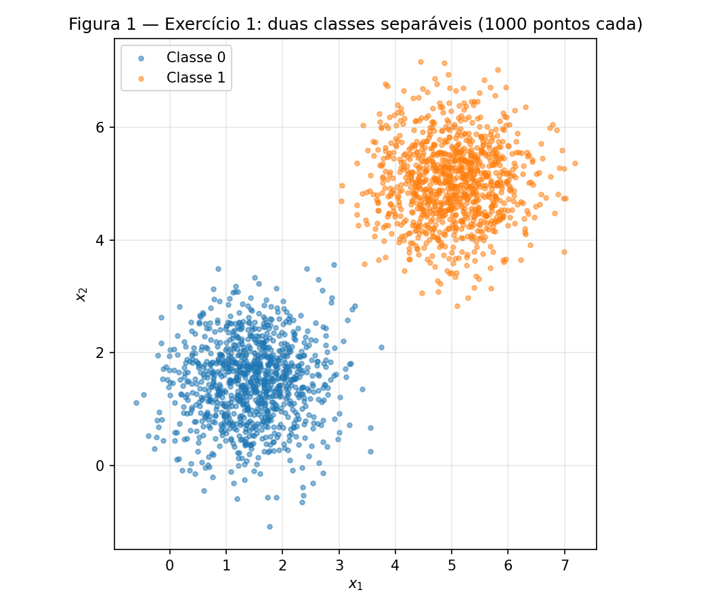
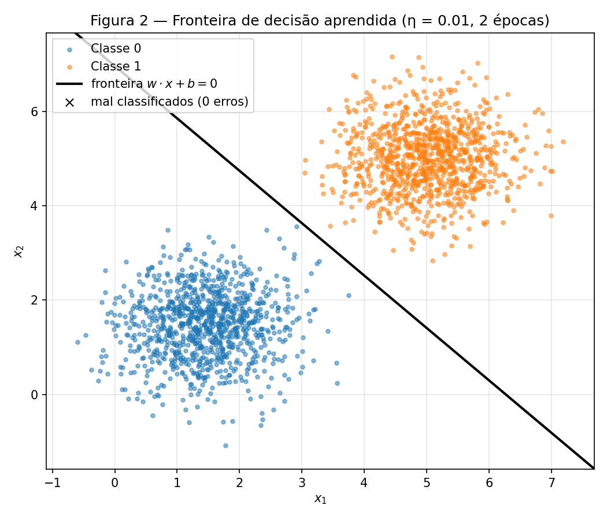
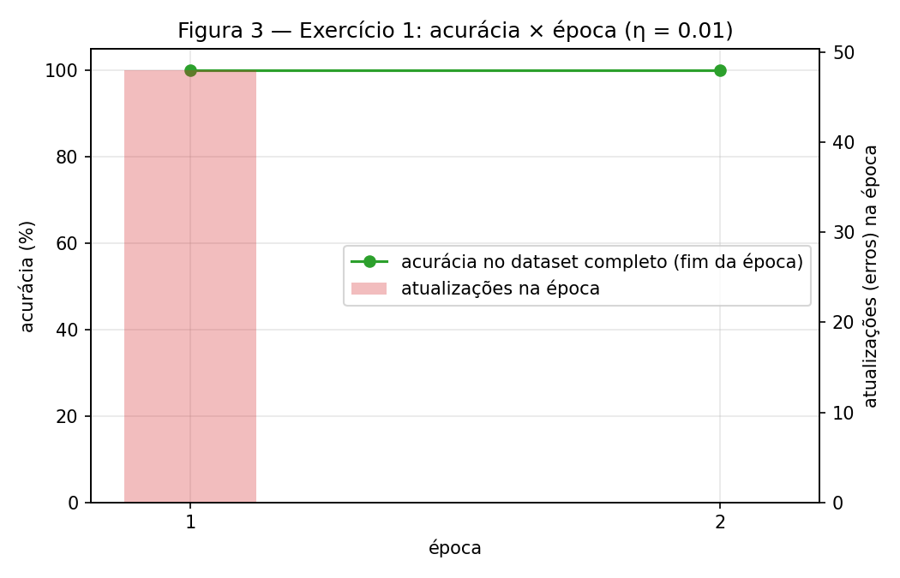
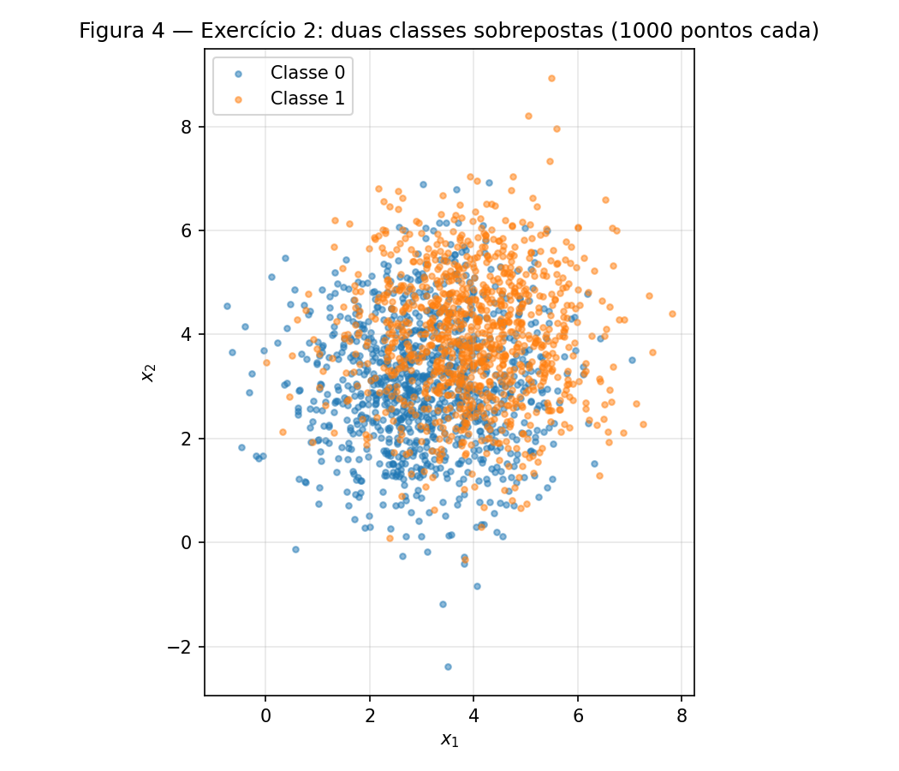
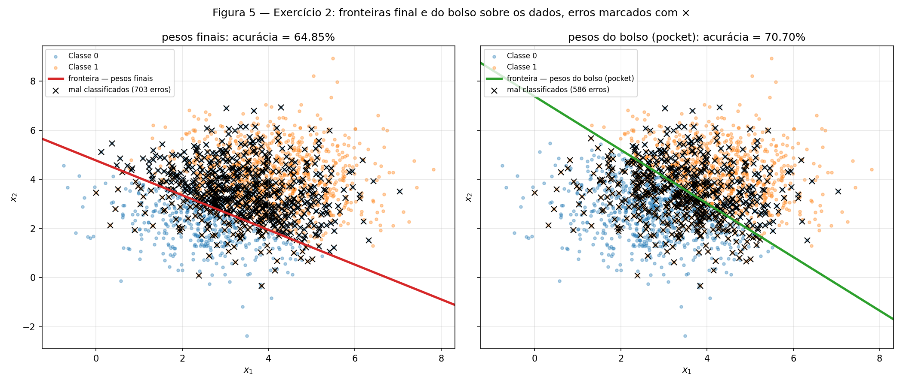
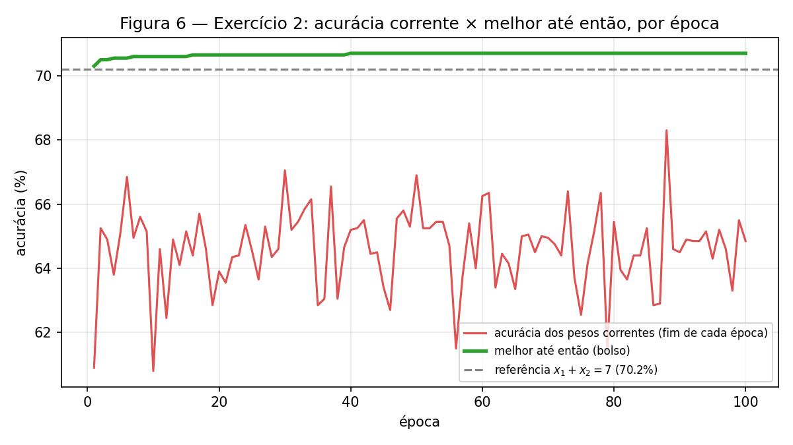

# Perceptron

!!! info inline end "Exercício"

    Perceptron — separabilidade e o algoritmo do bolso

    Fontes: [`code/`](https://github.com/carloshernanic/ann-dl/tree/main/docs/exercises/perceptron/code) ·
    Figuras: [`figures/`](https://github.com/carloshernanic/ann-dl/tree/main/docs/exercises/perceptron/figures)

O fio condutor desta atividade é a **separabilidade**: o mesmo perceptron é
treinado em dois datasets, um que o algoritmo resolve e um que ele não resolve,
e o interessante não é que o segundo falhe, mas *como* falha.

**Abordagem.** O perceptron foi escrito do zero, só com NumPy, em um módulo
próprio (`code/perceptron.py`): ativação degrau, predição
$\hat y = \text{step}(\mathbf{w}\cdot\mathbf{x} + b)$, regra de atualização
dirigida pelo erro com rótulos $\{0, 1\}$ e o laço de treinamento com o critério
de parada do enunciado. O mesmo módulo, sem nenhuma alteração, é usado nos dois
exercícios pelo script `code/run_exercises.py`, que gera os dados, treina,
produz as Figuras 1 a 6 e imprime todos os números citados abaixo. Regras
seguidas: `rng = np.random.default_rng(42)` como único gerador (dados,
inicialização e permutação), nenhuma biblioteca fornece o modelo, todo gráfico
tem título, rótulos e legenda.

Duas decisões de implementação que valem registro:

- **Ordem de visita fixa.** Cada dataset é embaralhado *uma vez* com o `rng`
  logo após ser gerado, e o laço percorre as amostras sempre nessa ordem. Assim,
  quando o item D pede para "mudar somente $\eta$", a inicialização
  $\mathbf{w}_0$ e a sequência de amostras são idênticas entre os treinos e a
  única diferença é mesmo $\eta$.
- **Bolso sempre ligado.** O laço avalia a acurácia no dataset completo após
  cada atualização e copia $(\mathbf{w}, b)$ quando ela supera a melhor já
  vista. No Exercício 1 isso é inócuo (o bolso coincide com os pesos finais);
  no Exercício 2 é o que salva o resultado.

A maior dificuldade foi decidir o que "mudar nada além de $\eta$" significa na
prática, o que levou à ordem fixa acima, e interpretar o resultado do Exercício
2, em que a acurácia final ficou acima dos ~50 % que o enunciado antecipava
(64.85 %). O item D.1 explica por quê.

``` python
--8<-- "docs/exercises/perceptron/code/perceptron.py"
```

``` python
--8<-- "docs/exercises/perceptron/code/run_exercises.py"
```

---

## Exercício 1

**Dados separáveis: o caso para o qual o perceptron foi projetado**

### A — Gere os dados

1000 amostras por classe, de normais multivariadas com
$\mu_0 = [1.5, 1.5]$, $\mu_1 = [5, 5]$ e a mesma covariância
$\Sigma = [[0.5, 0], [0, 0.5]]$. A distância entre as médias ($4.95$) é sete
vezes o desvio padrão de cada eixo ($0.71$), então as nuvens não se tocam.


/// caption
**Figura 1** — Exercício 1: as duas classes, 1000 pontos cada, uma cor por classe.
///

### B — Implemente o perceptron

A implementação está em `code/perceptron.py` (embutido acima). Os pontos que
o enunciado exige:

- **Predição.** $\hat y = \text{step}(\mathbf{w}\cdot\mathbf{x} + b)$, com
  $\text{step}(z) = 1$ se $z \ge 0$ e $0$ caso contrário (função `step`).
- **Regra de atualização.** Para cada amostra, na ordem fixa,
  $\mathbf{w} \leftarrow \mathbf{w} + \eta\,(y - \hat y)\,\mathbf{x}$ e
  $b \leftarrow b + \eta\,(y - \hat y)$. O erro $(y - \hat y)$ vale $0$ em um
  acerto (nenhuma atualização), $+1$ em um falso negativo e $-1$ em um falso
  positivo, então a regra corrige os dois tipos de erro com rótulos $\{0, 1\}$.
- **Inicialização.** $\mathbf{w}_0 \sim \mathcal{N}(0, 0.01)$, $b_0 = 0$. O
  sorteio deu $\mathbf{w}_0 = [0.0099, -0.0083]$, e esse mesmo vetor é reutilizado
  em todos os treinos do Exercício 1.
- **Taxa de aprendizado.** $\eta = 0.01$.
- **Parada.** Uma época inteira sem atualização, ou 100 épocas. A acurácia no
  dataset completo é registrada ao fim de cada época.

### C — Treine e meça

**1. Resultado do treino** ($\eta = 0.01$):

| Quantidade | Valor |
|---|---|
| $\mathbf{w}$ final | $[0.0319,\ 0.0287]$ |
| $b$ final | $-0.2000$ |
| Épocas | **2** (48 atualizações na época 1, 0 na época 2) |
| Acurácia final | **100.00 %** (0 erros em 2000) |

A fronteira é a reta $x_2 = 6.960 - 1.110\,x_1$, que passa a $0.07$ do ponto
médio entre as médias, $(3.25, 3.25)$.


/// caption
**Figura 2** — Fronteira de decisão $\mathbf{w}\cdot\mathbf{x} + b = 0$ sobre os
dados. Pontos mal classificados seriam marcados com ×; não há nenhum.
///


/// caption
**Figura 3** — Acurácia × época. Já ao fim da época 1 a acurácia é 100 %; a
época 2 não produz nenhuma atualização e o laço para. As barras mostram quantas
atualizações cada época gerou (48 e 0).
///

### D — Análise

**1. Por que dados separáveis convergem rápido.** A regra só atualiza quando
$(y - \hat y) \neq 0$, e cada atualização soma $\eta\,\mathbf{x}$ (ou subtrai)
ao vetor de pesos, empurrando a fronteira na direção do ponto errado. Como as
nuvens estão a sete desvios padrão de distância, existe uma faixa larga de
retas que acertam tudo; bastam poucas correções para $\mathbf{w}$ apontar
aproximadamente da classe 0 para a classe 1 (direção $[0.74, 0.67]$, quase a
diagonal $[0.71, 0.71]$ que liga as médias) e para $b$ deslocar a reta até o
meio do vão. O número de atualizações por época cai de 48 para 0: uma vez que
todos os pontos ficam do lado certo, nenhuma amostra gera erro, os pesos param
de mudar e a condição de parada é atingida. Este é o mecanismo do teorema de
convergência: com margem $\gamma > 0$ e $\lVert\mathbf{x}\rVert \le R$, o número
total de atualizações é limitado por $(R/\gamma)^2$, independentemente de
quantas épocas se percorra.

**2. Repetindo com $\eta = 1.0$** (mesmo $\mathbf{w}_0$, mesma ordem de
amostras, nada mais mudou):

| | $\eta = 0.01$ | $\eta = 1.0$ |
|---|---|---|
| Épocas | 2 (48 + 0 atualizações) | **2** (25 + 0 atualizações) |
| Acurácia final | 100 % | **100 %** |
| $\mathbf{w}$ final | $[0.0319, 0.0287]$ | $[1.7173, 1.6646]$ |
| $b$ final | $-0.2000$ | $-11.0$ |
| $\lVert\mathbf{w}\rVert$ | 0.043 | 2.392 |
| Direção $\mathbf{w}/\lVert\mathbf{w}\rVert$ | $[0.7429, 0.6694]$ | $[0.7181, 0.6960]$ |
| Reta | $x_2 = 6.960 - 1.110\,x_1$ | $x_2 = 6.608 - 1.032\,x_1$ |

As duas retas chegam a 100 %, mas não são a mesma: as direções diferem por
$2.09°$ e os interceptos por 0.35. O que $\eta$ controla é o **tamanho de cada
passo relativo ao que já existe em $\mathbf{w}$**. Os pesos começam com
magnitude $\approx 0.01$ e cada erro soma $\eta\,\mathbf{x}$, com
$\lVert\mathbf{x}\rVert$ entre 2 e 7. Com $\eta = 1.0$ a primeira atualização
tem magnitude $\approx 5$, quinhentas vezes maior que $\mathbf{w}_0$: a
inicialização é apagada no primeiro erro, e a solução é essencialmente a soma
dos poucos pontos errados (25 atualizações). Com $\eta = 0.01$ cada passo vale
$\approx 0.05$, comparável a $\mathbf{w}_0$ nos primeiros erros, então a
inicialização aleatória ainda "pesa" na direção final e são precisas mais
correções (48) para vencê-la. Ou seja: $\eta$ não muda a qualidade da solução em
dados separáveis, muda *qual* das infinitas retas separadoras é encontrada e
quantos erros são cometidos até lá, ao decidir quanto a inicialização
influencia o resultado.

**3. O que aconteceria a partir de $\mathbf{w} = \mathbf{0}$, $b = 0$.** Seja
$e_t = y_t - \hat y_t \in \{-1, 0, +1\}$ o erro na $t$-ésima amostra visitada.
Com início nulo, após $t$ visitas

$$
\mathbf{w}_t = \eta \sum_{s \le t} e_s\,\mathbf{x}_s, \qquad
b_t = \eta \sum_{s \le t} e_s .
$$

Por indução: suponha que, com $\eta_1$ e $\eta_2$, as duas execuções
cometeram exatamente os mesmos erros até a visita $t - 1$, de modo que
$\mathbf{w}^{(2)}_{t-1} = \frac{\eta_2}{\eta_1}\mathbf{w}^{(1)}_{t-1}$ e
$b^{(2)}_{t-1} = \frac{\eta_2}{\eta_1} b^{(1)}_{t-1}$ (vale trivialmente para
$t = 1$, em que tudo é zero). Então
$\mathbf{w}^{(2)}\cdot\mathbf{x}_t + b^{(2)} = \frac{\eta_2}{\eta_1}\left(\mathbf{w}^{(1)}\cdot\mathbf{x}_t + b^{(1)}\right)$,
e como $\eta_2/\eta_1 > 0$ o sinal é o mesmo, logo $\hat y_t$ é o mesmo, $e_t$
é o mesmo, e a atualização preserva a proporcionalidade:
$\mathbf{w}^{(2)}_t = \frac{\eta_2}{\eta_1}\mathbf{w}^{(1)}_t$. Portanto as duas
trajetórias diferem apenas pelo fator constante $\eta_2/\eta_1$ em todo
instante. A fronteira $\mathbf{w}\cdot\mathbf{x} + b = 0$ é invariante a esse
fator, a sequência de erros é idêntica e o número de épocas também: $\eta$ não
tem efeito nenhum. Confirmação numérica com $\mathbf{w}_0 = \mathbf{0}$:
$\eta = 0.01$ dá $\mathbf{w} = [0.0171, 0.0167]$, $b = -0.11$;
$\eta = 1.0$ dá $\mathbf{w} = [1.7074, 1.6729]$, $b = -11.0$; a razão é
exatamente 100 em cada componente, ambos com 2 épocas e a mesma contagem de
atualizações. É por isso que o item B proíbe o início nulo: com
$\mathbf{w}_0 \neq \mathbf{0}$ o termo $\mathbf{w}_0$ não escala com $\eta$, e a
taxa de aprendizado passa a ter efeito.

---

## Exercício 2

**Dados sobrepostos: o caso que o perceptron não resolve**

### A — Gere os dados

1000 amostras por classe, com $\mu_0 = [3, 3]$, $\mu_1 = [4, 4]$ e
$\Sigma = [[1.5, 0], [0, 1.5]]$. Agora a distância entre as médias ($1.41$) é
pouco mais que um desvio padrão ($1.22$): as nuvens se sobrepõem fortemente e
nenhuma reta as separa. A norma média dos pontos é
$\lVert\mathbf{x}\rVert \approx 5.1$.


/// caption
**Figura 4** — Exercício 2: as duas classes sobrepostas, 1000 pontos cada.
///

### B — Treine guardando os melhores pesos

Mesma implementação, $\eta = 0.01$, teto de 100 épocas,
$\mathbf{w}_0 = [-0.0146, -0.0046]$. O laço **não convergiu**: rodou as 100
épocas e a última ainda produziu 757 atualizações (76 620 no total).

| | $\mathbf{w}$ | $b$ | Acurácia |
|---|---|---|---|
| **Pesos finais** (após a época 100) | $[0.0682,\ 0.0965]$ | $-0.4600$ | **64.85 %** (703 erros) |
| **Pesos do bolso** (melhor até então) | $[0.0709,\ 0.0650]$ | $-0.4800$ | **70.70 %** (586 erros) |

O melhor do bolso ocorreu na **época 40** (atualização nº 30 008). A acurácia
dos pesos correntes, medida ao fim de cada época, oscilou entre 60.8 % e
68.3 % (média 64.6 %) sem nunca se estabilizar.

### C — Figuras


/// caption
**Figura 5** — Fronteiras final (vermelha) e do bolso (verde) sobre os dados,
com os pontos mal classificados por cada uma marcados com ×.
///


/// caption
**Figura 6** — Acurácia dos pesos correntes ao fim de cada época (vermelho) e
melhor até então, o bolso (verde). A linha tracejada é a reta de referência
$x_1 + x_2 = 7$, a bissetriz perpendicular entre as médias.
///

### D — Análise

**1. A diferença entre final e bolso.** A melhor reta possível para estas
gaussianas de mesma covariância é a bissetriz perpendicular entre as médias,
$x_1 + x_2 = 7$; ela acerta 70.20 % desta amostra (o valor teórico é
$\Phi(d/2\sigma) = \Phi(0.577) \approx 72\%$, os ~73 % do enunciado). O bolso
chegou a 70.70 %, ligeiramente acima da referência porque se ajusta ao ruído
desta amostra; os pesos finais ficaram em 64.85 %. A diferença vem da
**posição da fronteira**. Normalizando por $\lVert\mathbf{w}\rVert$, a
distância da reta à origem é $-b/\lVert\mathbf{w}\rVert$: para o bolso ela vale
4.99, praticamente a da reta ideal ($7/\sqrt{2} = 4.95$), e a fronteira passa a
0.04 do centro da nuvem, $(3.5, 3.5)$, dividindo os pontos em 47.8 % / 52.2 %.
Para os pesos finais ela vale 3.89: a reta está deslocada quase uma unidade
para dentro da nuvem da classe 0, e o modelo prevê classe 1 para 75.7 % dos
pontos (Figura 5, painel esquerdo, com a faixa de × azuis acima da reta).

Por que o laço a deixa ali? Pela assimetria da regra que a dica aponta. Cada
erro move $b$ em $\eta = 0.01$, mas move $\mathbf{w}$ em
$\eta\,\mathbf{x}$, cuja magnitude é $\approx 0.05$, e $\lVert\mathbf{w}\rVert$
é só 0.12: **um único erro altera $\mathbf{w}$ em cerca de 40 % da sua
magnitude**, enquanto $b$ mal se mexe. Como a posição da reta depende da razão
$b/\lVert\mathbf{w}\rVert$, um falso negativo (soma $\eta\,\mathbf{x}$, aumenta
$\lVert\mathbf{w}\rVert$) puxa a fronteira para perto da origem, e um falso
positivo (subtrai) a empurra para longe, cada um por cerca de uma unidade. Em
dados sobrepostos há ~750 erros por época, alternando entre os dois tipos, e a
fronteira fica balançando em torno do meio da nuvem com amplitude comparável
ao próprio vão entre as classes. Os "pesos finais" são apenas o instante em que
o contador de épocas bateu 100: os últimos erros da época 100 foram falsos
negativos, a reta acabou perto da classe 0, e a acurácia daquele instante foi
64.85 %. Com outra ordem de amostras, ou parando uma época antes, o número seria
outro (a Figura 6 mostra ele variando de 61 % a 68 % época a época). O bolso
não sofre disso porque não é um instante: é o máximo sobre todos os instantes.

**2. Figura 3 × Figura 6 e o teorema de convergência.** No Exercício 1 a curva
sobe a 100 % e fica lá, porque a partir do momento em que não há erros não há
atualizações, e o laço para. No Exercício 2 a curva vermelha nunca assenta: oscila
por 100 épocas e continuaria oscilando. O teorema de convergência do perceptron
(Novikoff) garante que, **se** existe um vetor $(\mathbf{w}^*, b^*)$ que separa
todos os pontos com margem $\gamma > 0$ e $\lVert\mathbf{x}\rVert \le R$, então o
algoritmo faz no máximo $(R/\gamma)^2$ atualizações e para. A hipótese violada
aqui é a **separabilidade linear**: não existe reta com todos os pontos do lado
certo, logo não existe $\gamma > 0$ e o limite de atualizações não se aplica.
Sem separador, qualquer par $(\mathbf{w}, b)$ comete erros, todo erro gera uma
atualização, e o processo não tem ponto fixo. O que o teorema *não* garante,
mesmo em dados separáveis, é qual reta será encontrada, o que o item D.2 do
Exercício 1 mostrou.

**3. Mais épocas ou $\eta$ menor resolvem?** Não, e a razão está na regra e não
em tentativa e erro. *Mais épocas:* o laço só para quando uma época inteira não
produz atualização, o que exige zero erros no dataset; como isso é impossível em
dados sobrepostos, cada época seguirá cometendo centenas de erros e movendo os
pesos, e o "final" continuará sendo um instante arbitrário da mesma oscilação.
Com 500 épocas os pesos finais deram 63.40 % e a última época ainda teve 767
atualizações; o bolso subiu só de 70.70 % para 70.75 %, ganho de ajuste ao
ruído. *$\eta$ menor:* pela álgebra do item D.3 do Exercício 1, os pesos são
$\mathbf{w}_0 + \eta\sum_s e_s\mathbf{x}_s$. Assim que a soma acumulada domina
$\mathbf{w}_0$ (o que leva poucos erros), $\eta$ é um fator de escala comum a
$\mathbf{w}$ e $b$: a posição da fronteira e a sequência de erros ficam as
mesmas, e o passo *relativo* $\eta\lVert\mathbf{x}\rVert/\lVert\mathbf{w}\rVert$
não diminui, porque $\lVert\mathbf{w}\rVert$ encolhe junto. Reduzir $\eta$ não
reduz o balanço da fronteira, só reescala os números. Com $\eta = 0.001$ o
resultado foi $\mathbf{w} = [0.0078, 0.0081]$, $b = -0.048$ (tudo dividido por
~10), pesos finais em 68.25 %, bolso em 70.70 %, e 100 épocas de atualizações
sem parar. O que resolve é mudar o critério, não o tamanho do passo: guardar o
melhor (bolso), otimizar uma perda que tenha mínimo mesmo com erros (regressão
logística, margem), ou aceitar que o teto de qualquer reta é ~72 % e usar um
modelo não linear.

---

## Resumo dos resultados

| # | Quantidade | Valor |
|---|---|---|
| 1 | Exercício 1 — $\mathbf{w}$ e $b$ finais | $\mathbf{w} = [0.0319,\ 0.0287]$, $b = -0.2000$ |
| 2 | Exercício 1 — épocas até convergir | 2 (48 atualizações na época 1, 0 na época 2) |
| 3 | Exercício 1 — acurácia final | 100.00 % |
| 4 | Exercício 1 — épocas e acurácia final com $\eta = 1.0$ | 2 épocas, 100.00 % ($\mathbf{w} = [1.7173, 1.6646]$, $b = -11.0$) |
| 5 | Exercício 2 — $\mathbf{w}$ e $b$ finais | $\mathbf{w} = [0.0682,\ 0.0965]$, $b = -0.4600$ |
| 6 | Exercício 2 — acurácia dos pesos finais | 64.85 % |
| 7 | Exercício 2 — acurácia dos pesos do pocket | 70.70 % ($\mathbf{w} = [0.0709, 0.0650]$, $b = -0.4800$) |
| 8 | Exercício 2 — época em que o melhor do pocket ocorreu | época 40 (atualização nº 30 008) |
